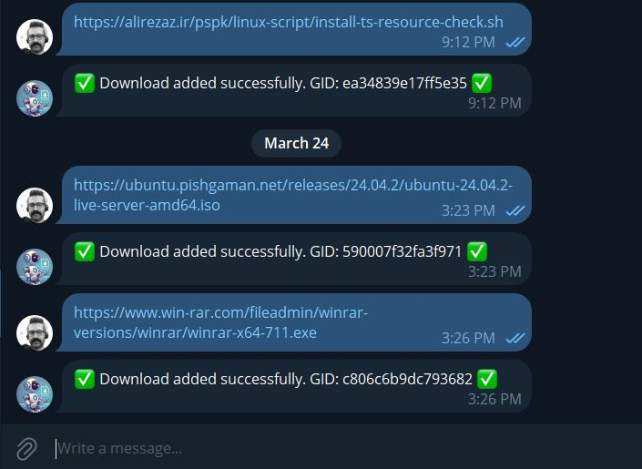

```
██████╗ ██╗      ██████╗  █████╗ ██████╗ ██████╗  ██████╗ ██╗  ██╗
██╔══██╗██║     ██╔═══██╗██╔══██╗██╔══██╗██╔══██╗██╔═══██╗╚██╗██╔╝
██║  ██║██║     ██║   ██║███████║██║  ██║██████╔╝██║   ██║ ╚███╔╝
██║  ██║██║     ██║   ██║██╔══██║██║  ██║██╔══██╗██║   ██║ ██╔██╗
██████╔╝███████╗╚██████╔╝██║  ██║██████╔╝██████╔╝╚██████╔╝██╔╝ ██╗
╚═════╝ ╚══════╝ ╚═════╝ ╚═╝  ╚═╝╚═════╝ ╚═════╝  ╚═════╝ ╚═╝  ╚═╝
                Full Download and File Manager Platform
                                    ‌by  A.ZOLFAGHAR

```
# DloadBox
DloadBox is a complete download management platform combining aria2c, Caddy, ariaNG, RPC integration, and a Telegram bot. It offers a user-friendly web interface and remote control, enabling efficient and scalable management of downloads from anywhere.

# Screenshots

<p align="center">
  <a href="images/1.JPG"></a>
  <a href="images/2.JPG"></a>
  <a href="images/3.JPG"></a>
  <a href="images/4.JPG"></a>
  <a href="images/5.JPG"></a>
  <a href="images/6.JPG"></a>
  <a href="images/7.JPG"></a>
</p>

# Coming soon...
# DloadBox - Alpha Version Installer

We are approaching the launch of the first version of DloadBox! For now, enthusiasts can install and use the Alpha version with this installer without any issues.

Currently, it has been tested only on Ubuntu, but it is designed for all 64-bit Linux distributions. Feel free to test it on your Linux systems and open issues if you encounter any problems or have feature requests.


## Installation Instructions:

Download and Run the installer using the following commands:

```
wget https://github.com/azolfagharj/DloadBox/releases/latest/download/dloadbox-installer.sh && \
chmod +x dloadbox-installer.sh && \
./dloadbox-installer.sh

```
That's it! The installer will handle everything for you automatically.

## Open-Source Software Used in This Project

This platform utilizes various open-source projects to provide its core functionalities. Below is a list of the software used, along with their respective licenses and purposes:

- **[Caddy](https://github.com/caddyserver/caddy)** – Used as the web server.
  - **License**: [Apache License 2.0](https://github.com/caddyserver/caddy/blob/master/LICENSE)

- **[aria2](https://github.com/aria2/aria2)** – Used as the download manager.
  - **License**: [GNU General Public License (GPL) v2](https://github.com/aria2/aria2/blob/master/COPYING)

- **[aria2-static-builds](https://git.q3aql.dev/q3aql/aria2-static-builds)** – Prebuilt static binaries of aria2 used for easier deployment.
  - **License**: [GNU General Public License (GPL) v2](https://github.com/aria2/aria2/blob/master/COPYING)

- **[AriaNg](https://github.com/mayswind/AriaNg)** – A web-based frontend for aria2.
  - **License**: [MIT License](https://github.com/mayswind/AriaNg/blob/master/LICENSE)

- **[File Browser](https://github.com/filebrowser/filebrowser)** – Used as the file manager to browse and manage downloaded files.
  - **License**: [Apache License 2.0](https://github.com/filebrowser/filebrowser/blob/main/LICENSE)